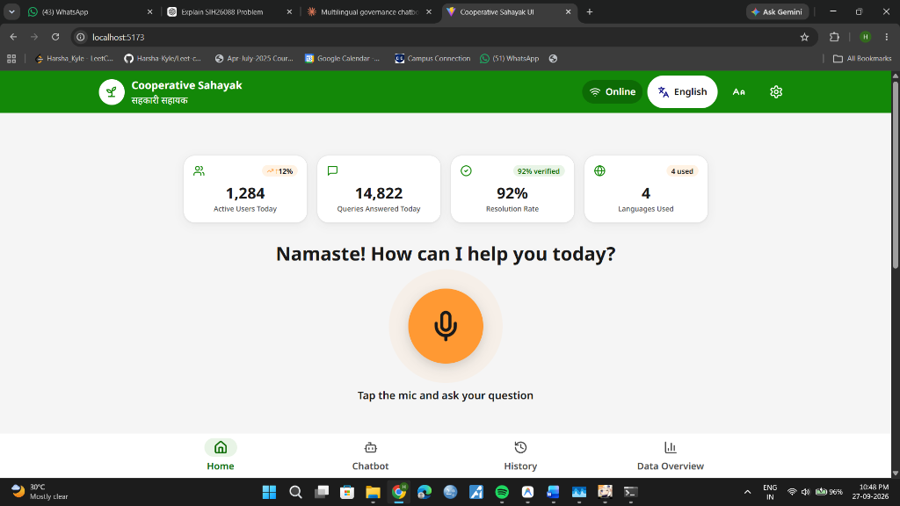
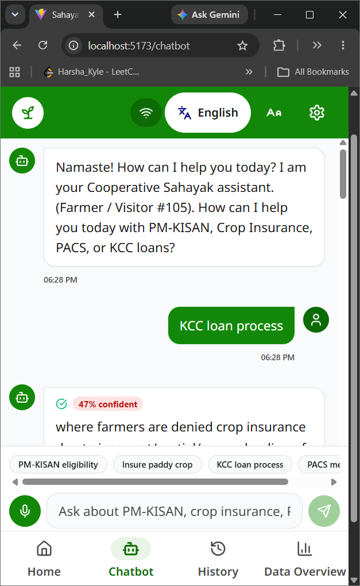
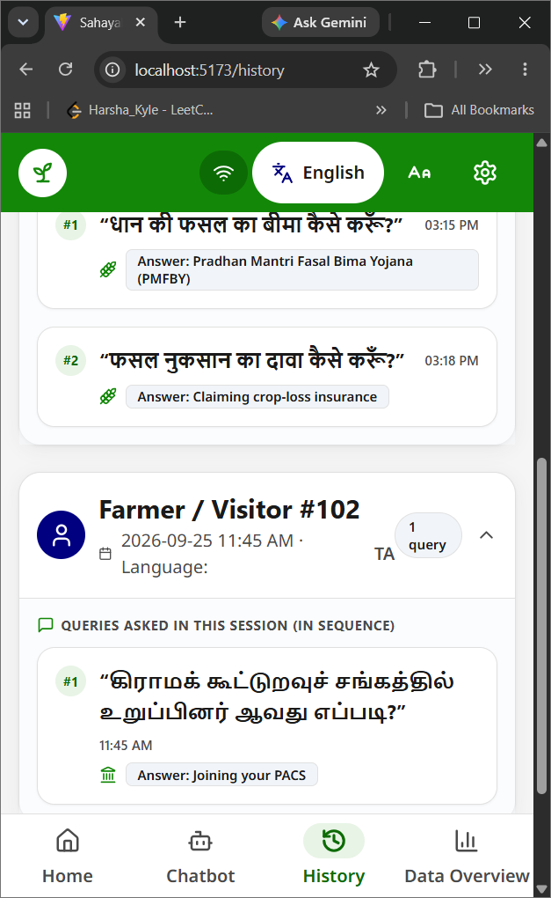
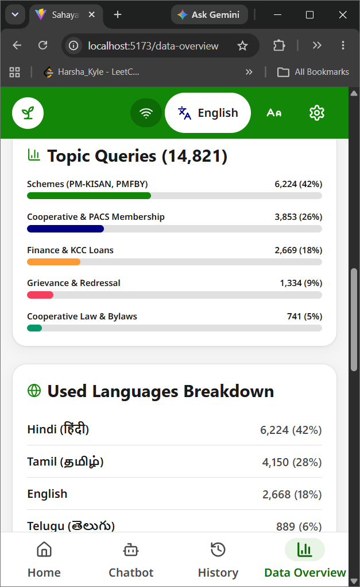
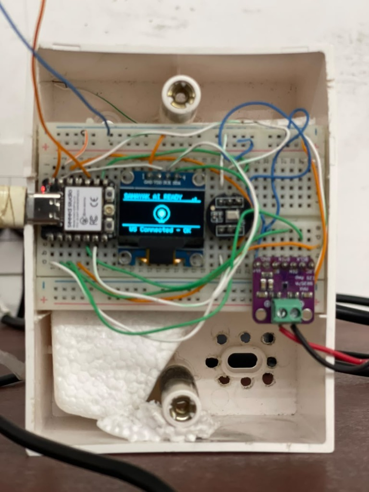
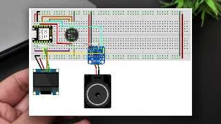

# 🌾 Sahayak AI (सहायक AI)
### *Voice-First Multilingual Rural Governance, Agriculture & Legal Assistance Platform*

[](https://www.python.org/)
[](https://react.dev/)
[](https://fastapi.tiangolo.com/)
[](https://www.espressif.com/)
[](https://deepmind.google/technologies/gemini/)
[](https://www.sarvam.ai/)
[](https://www.assemblyai.com/)

---

## 🌟 Overview

**Sahayak AI** is an end-to-end, voice-first AI assistance platform engineered for farmers, rural cooperative members (PACS), and grassroots citizens across India. It breaks down language barriers and digital illiteracy by allowing citizens to ask complex agricultural, financial, scheme, and legal questions in their native language—either through an intuitive web kiosk interface or via a dedicated hardware smart device powered by **ESP32-C3**.

---

## 🖼️ User Interface & Hardware Showcase

### 💻 Web Kiosk Screenshots

| Home Page Kiosk Interface | Interactive Voice Chatbot |
| :---: | :---: |
|  |  |

| Session Query History | Real-Time Data Analytics |
| :---: | :---: |
|  |  |

### ⚡ ESP32-C3 Hardware Setup

| ESP32-C3 Smart Hardware Unit | Hardware Wiring Diagram |
| :---: | :---: |
|  |  |


---

## ✨ Key Features

- 🎙️ **Voice-First Experience**: Speak naturally in your native language; receives responses spoken aloud via high-quality Text-to-Speech (TTS).
- 🗣️ **Multilingual Support**: Full support for Indian regional languages including **English, Hindi (हिंदी), Tamil (தமிழ்)** with auto-language detection.
- 📚 **Retrieval-Augmented Generation (RAG)**: Grounded in official government schemes & laws (PM-KISAN, PMFBY, KCC, PACS Model Byelaws, Tamil Nadu Cooperative Societies Act).
- 🏷️ **Verifiable Citations & Confidence**: Displays exact government policy documents and calculates confidence scores for total transparency.
- 📟 **Hardware Integration (ESP32-C3 Smart Device)**: Real-time WebSockets synchronization, OLED intro animation, state transitions, and audio streaming.
- 🔘 **Physical One-Touch Push Button**: Single hardware button press triggers laptop mic recording & opens chatbot automatically; second press stops mic & starts AI response.
- ⚡ **Kyoma Low-Latency Architecture**: Streamlined single-call TTS pipeline ensures zero duplicate audio rendering and ultra-fast turnaround.

---

## 🏗️ System Architecture

```
                    ┌──────────────────────────────────────────────┐
                    │               USER / FARMER                  │
                    └──────┬────────────────────────────────┬──────┘
                           │ Physical Button / Mic          │ Laptop Mic
                           ▼                                ▼
              ┌─────────────────────────┐      ┌─────────────────────────┐
              │   ESP32-C3 Smart Device │      │    Web Kiosk Frontend   │
              │(OLED + Button + Speaker)│      │     (React + Vite)      │
              └────────────┬────────────┘      └────────────┬────────────┘
                           │                                │
                           └──────────────┬─────────────────┘
                                          │ WebSockets / REST API
                                          ▼
                              ┌────────────────────────┐
                              │ FastAPI Backend Server │
                              └───────────┬────────────┘
                                          │
       ┌───────────────────┬──────────────┼──────────────┬───────────────────┐
       ▼                   ▼              ▼              ▼                   ▼
┌──────────────┐   ┌──────────────┐   ┌───────┐   ┌──────────────┐   ┌──────────────┐
│ AssemblyAI   │   │ Sentence     │   │ SQLite│   │ Google Gemini│   │  Sarvam AI   │
│ Speech-to-   │   │ Transformers │   │ Vector│   │      LLM     │   │ Text-to-     │
│ Text (STT)   │   │  (BAAI/bge)  │   │ Store │   │  (Gemini API)│   │ Speech (TTS) │
└──────────────┘   └──────────────┘   └───────┘   └──────────────┘   └──────────────┘
```

---

## 🛠️ Hardware Pinout Matrix

| Hardware Component | Hardware Part | Pin Connections | Purpose |
| :--- | :--- | :--- | :--- |
| **Microcontroller** | Seeed Studio XIAO ESP32-C3 | Wi-Fi 2.4GHz + I2S + I2C | Core system controller & WebSocket client |
| **OLED Display** | SSD1306 128x64 (I2C) | **SDA** = GPIO 6<br>**SCL** = GPIO 7 | Futuristic intro animation, state & confidence display |
| **Microphone** | INMP441 I2S Digital Mic | **SCK** = GPIO 20<br>**WS** = GPIO 10<br>**SD** = GPIO 2 | Push-to-talk audio input capture |
| **Speaker Amplifier** | MAX98357A I2S Class D Amp | **BCLK** = GPIO 4<br>**LRC** = GPIO 5<br>**DIN** = GPIO 3 | Plays high-clarity response audio from Sarvam AI |
| **Push Button** | Physical Tactile Switch | **PIN** = GPIO 9<br>**GND** = Ground | One-touch physical trigger (`INPUT_PULLUP`) |

---

## 💻 Tech Stack

- **Frontend**: React 18, Vite, TypeScript, Tailwind CSS, Lucide Icons, React Router DOM.
- **Backend**: Python 3.11+, FastAPI, Uvicorn, WebSockets, SQLite, Sentence-Transformers (`BAAI/bge-m3`).
- **AI Engines**:
  - **LLM**: Google Gemini API (`gemini-1.5-flash`).
  - **Speech-to-Text**: AssemblyAI API.
  - **Text-to-Speech**: Sarvam AI `bulbul:v3` (22050Hz Mono → 16000Hz PCM Stereo).
- **ESP32 Firmware**: C++ (PlatformIO / Arduino Framework), WebSocketsClient, Adafruit GFX, Adafruit SSD1306, ArduinoJson.

---

## 📖 Step-by-Step Installation & User Guide

### 1. Prerequisites
Ensure you have the following installed on your machine:
- **Node.js**: v18+ ([Download](https://nodejs.org/))
- **Python**: v3.11+ ([Download](https://www.python.org/))
- **Git**: ([Download](https://git-scm.com/))
- **PlatformIO**: Installed via VS Code extension (Only needed if flashing ESP32 firmware)

---

### 2. Cloning the Repository
```bash
git clone https://github.com/Harsha-Kyle/SAHAYAK-AI.git
cd SAHAYAK-AI
```

---

### 3. API Keys Setup
Create a file named `.env` inside the `backend/` directory:

```env
DATABASE_URL=sqlite:///./sahayak.db
GEMINI_API_KEY=your_gemini_api_key_here
ASSEMBLYAI_API_KEY=your_assemblyai_api_key_here
SARVAM_API_KEY=your_sarvam_api_key_here
ESP32_API_KEY=sahayak_secret_esp32_key_2026
```

---

### 4. Running the Application

#### Option A: 1-Click Auto Launcher (Recommended for Windows)
Simply double-click `start.bat` or run in terminal:
```bash
.\start.bat
```
This automatically handles virtualenv creation, dependency installation, document vector ingestion, and launches both backend (`http://localhost:8000`) and frontend (`http://localhost:5173`).

#### Option B: Manual Setup

**Frontend Setup**:
```bash
npm install
npm run dev
```
*(Frontend runs at `http://localhost:5173`)*

**Backend Setup**:
```bash
cd backend
python -m venv venv
# On Windows:
.\venv\Scripts\activate
# On Linux/macOS:
# source venv/bin/activate

pip install -r requirements.txt
python scripts/ingest_documents.py
python -m uvicorn app.main:app --host 0.0.0.0 --port 8000 --reload
```

---

### 5. Flashing the ESP32 Firmware (Optional Hardware Step)
1. Open the `esp32_firmware/` folder in VS Code with the PlatformIO extension.
2. Update the Wi-Fi credentials in `esp32_firmware/src/main.cpp`:
   ```cpp
   const char* ssid     = "YOUR_WIFI_NAME";
   const char* password = "YOUR_WIFI_PASSWORD";
   const char* ws_host  = "YOUR_LAPTOP_LOCAL_IP"; // e.g. 192.168.1.10
   ```
3. Connect your Seeed Studio XIAO ESP32-C3 via USB and click **Upload** in PlatformIO.

---

### 💡 How to Use

1. **Open Kiosk Web App**: Go to `http://localhost:5173` in your browser.
2. **Press Orange Mic Button (Web)** OR **Physical Button (ESP32)**:
   - **1st Press**: Starts laptop microphone recording. OLED shows `LISTENING`.
   - **2nd Press**: Stops microphone recording and runs AI pipeline. OLED shows `PROCESSING AI...`.
3. **View & Listen**: Transcribed text, LLM answer, confidence percentage, and official policy citations appear on the screen while voice response audio plays aloud from the laptop/ESP32 speaker.

---

## 📄 License & Acknowledgments

Built for empowering rural agriculture, cooperative governance, and financial inclusion under the **Smart India Hackathon (SIH)** framework.
